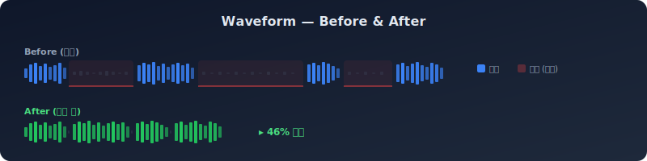
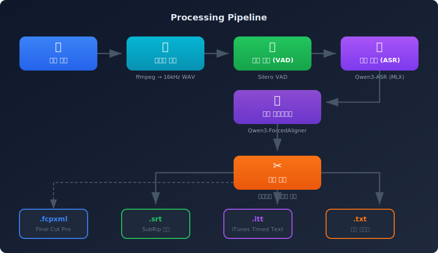
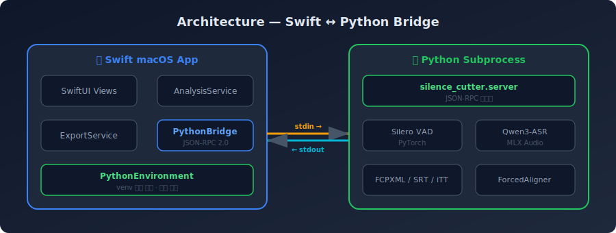
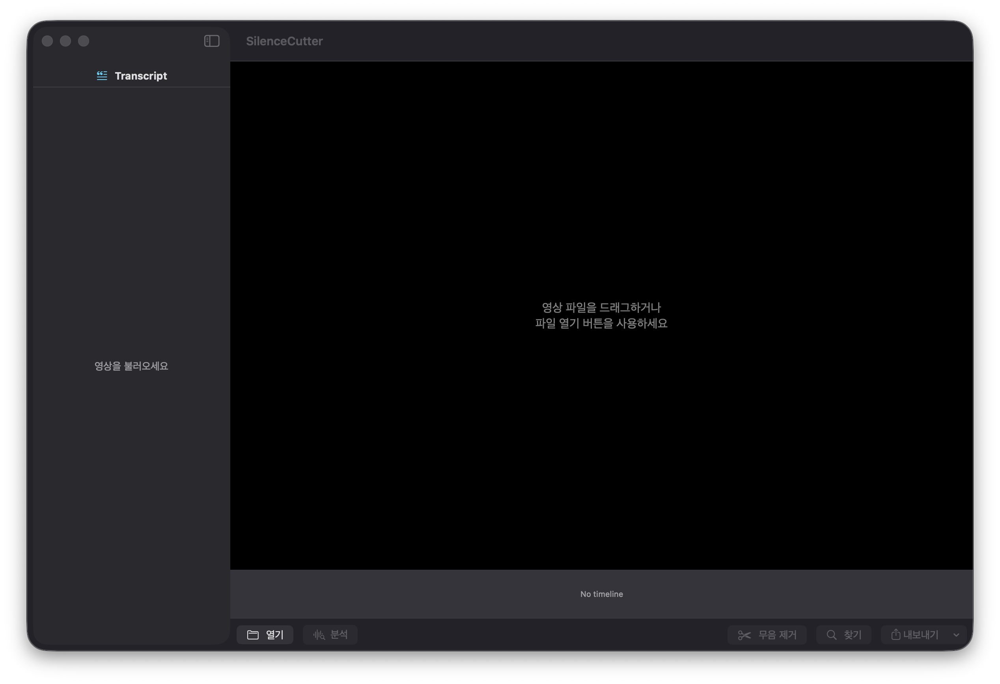
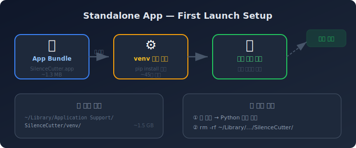
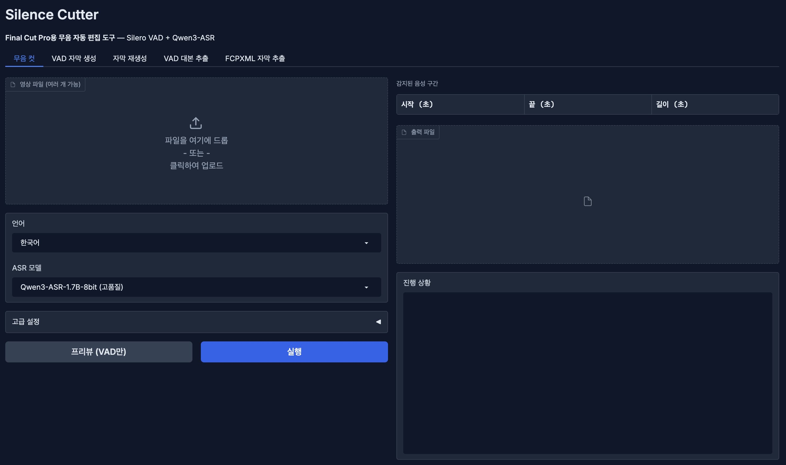

<div align="center">

# 🎬 Silence Cutter

**AI 무음 자동 편집 · 자막 생성 도구**

Silero VAD + Qwen3-ASR 기반 — macOS Apple Silicon 최적화

[](https://www.apple.com/macos/)
[](https://python.org)
[](https://github.com/ml-explore/mlx)
[](LICENSE)

<br/>



<br/>

영상에서 무음 구간을 자동 감지·제거하고, 단어 단위 타임스탬프 자막과 함께
FCPXML을 생성합니다.

[macOS 앱](#-macos-앱) · [CLI 사용법](#-cli-명령어) · [Web UI](#-web-ui) · [설치](#-설치)

</div>

---

## ✨ 주요 기능

<table>
<tr>
<td width="50%">

### 🔇 무음 컷 편집
- Silero VAD로 음성/무음 정밀 감지
- 무음 구간 자동 제거 → 컴팩트 타임라인
- FCPXML 출력 (Final Cut Pro 바로 임포트)
- 멀티 영상 병합 지원

</td>
<td width="50%">

### 🗣️ AI 음성 인식
- **Qwen3-ASR** — 고품질 음성→텍스트 (0.6B / 1.7B)
- **Qwen3-ForcedAligner** — 단어 단위 정밀 타임스탬프
- 다국어: 한국어 · 영어 · 일본어 · 중국어
- MLX 8-bit 양자화 — Apple Silicon 최적화

</td>
</tr>
<tr>
<td>

### ✂️ 스마트 자막 분할
- 한국어 종결어미·구두점 기반 자연스러운 줄 분할
- FCPXML 내장 타이틀, SRT, iTT 포맷 지원
- 폰트 크기, 최대 글자 수 커스터마이징

</td>
<td>

### 📱 3가지 인터페이스
- **macOS 네이티브 앱** — 드래그 앤 드롭 UI
- **CLI** — 스크립트/자동화에 최적
- **Web UI** — Gradio 기반 브라우저 인터페이스

</td>
</tr>
</table>

---

## 🔬 처리 파이프라인

<div align="center">

</div>

> 영상 입력 → ffmpeg 오디오 추출 → Silero VAD 음성 감지 → Qwen3-ASR 음성 인식 → ForcedAligner 단어 타임스탬프 → 자막 분할 → 다양한 포맷으로 출력

---

## 🏗️ 아키텍처

<div align="center">

</div>

Swift macOS 앱이 Python subprocess와 **JSON-RPC 2.0** 프로토콜로 통신합니다.
stdin/stdout 파이프를 통해 요청·응답을 주고받으며, 진행률 알림(notification)도 실시간으로 전달됩니다.

---

## 🖥️ macOS 앱

네이티브 SwiftUI 앱으로, 드래그 앤 드롭으로 영상을 불러오고 분석·편집·내보내기까지 한 화면에서 처리합니다.

<div align="center">

</div>

### 빌드 & 실행

```bash
./build-release.sh                # 빌드 → dist/SilenceCutterApp.app
open dist/SilenceCutterApp.app    # 실행
```

### 첫 실행 자동 설치

<div align="center">

</div>

처음 실행하면 Python 환경을 **자동으로 설치**합니다 (약 45초 소요).
설치 진행 상태가 화면에 표시되며, 이후 실행에서는 즉시 시작됩니다.

### 데이터 저장 경로

| 항목 | 경로 | 크기 |
|:---:|------|:---:|
| 🐍 Python venv | `~/Library/Application Support/SilenceCutter/venv/` | ~1.5 GB |
| 🤖 ASR 모델 캐시 | `~/.cache/huggingface/hub/` | ~2 GB |

### 앱 삭제 (완전 제거)

macOS는 `.app`을 휴지통에 버려도 Application Support 데이터는 자동 삭제되지 않습니다.

**방법 1 — 앱 내에서 삭제:**

> 메뉴바 → **SilenceCutter** → **Python 환경 삭제** 클릭

**방법 2 — 수동 삭제:**

```bash
# Python 가상환경 삭제
rm -rf ~/Library/Application\ Support/SilenceCutter/

# (선택) ASR 모델 캐시 삭제 — 다른 앱과 공유될 수 있음
rm -rf ~/.cache/huggingface/hub/models--mlx-community--Qwen3-*
```

---

## 🌐 Web UI

Gradio 기반 브라우저 인터페이스. 5개 탭으로 모든 기능을 지원합니다.

<div align="center">

</div>

```bash
./run.sh                          # 기본 실행 (포트 7860)
./run.sh --port 8080 --share      # 포트 지정 + 공유 링크
```

| 탭 | 설명 |
|:---|:-----|
| **무음 컷** | 영상 → 무음 제거 + 자막 FCPXML |
| **VAD 자막 생성** | 원본 타임라인 기준 SRT/iTT |
| **자막 재생성** | 편집된 FCPXML 자막 재생성 |
| **VAD 대본 추출** | 대본 텍스트 추출 |
| **FCPXML 자막 추출** | FCPXML 내 타이틀 텍스트 추출 |

---

## ⌨️ CLI 명령어

```bash
# 모듈 실행
python -m silence_cutter <command> [options]

# 엔트리포인트 (pip install -e . 이후)
silence-cutter <command> [options]
```

### `cut` — 무음 컷 + 자막

```bash
silence-cutter cut input.mp4                        # 기본
silence-cutter cut input.mp4 -o output.fcpxml       # 출력 경로 지정
silence-cutter cut input.mp4 -l English --itt       # 영어 + iTT 동시 생성
```

<details>
<summary><b>📋 전체 옵션</b></summary>

| 옵션 | 기본값 | 설명 |
|:-----|:------:|:-----|
| `-o, --output` | `<입력>.fcpxml` | 출력 경로 |
| `-l, --language` | `Korean` | 음성 언어 |
| `--asr-model` | `Qwen3-ASR-1.7B-8bit` | ASR 모델 |
| `--aligner-model` | `Qwen3-ForcedAligner-0.6B-8bit` | 정렬 모델 |
| `--vad-threshold` | `0.5` | VAD 민감도 (0~1, 낮을수록 민감) |
| `--min-speech-ms` | `250` | 최소 음성 구간 (ms) |
| `--min-silence-ms` | `300` | 최소 무음 구간 (ms) |
| `--speech-pad-ms` | `100` | 음성 앞뒤 패딩 (ms) |
| `--font-size` | `42` | 자막 폰트 크기 |
| `--max-subtitle-chars` | `20` | 한 줄 최대 글자 수 |
| `--itt` | `false` | iTT 자막 동시 생성 |

</details>

### `multi` — 멀티 영상 병합

```bash
silence-cutter multi video1.mp4 video2.mp4 -o merged.fcpxml --itt
```

### `script` — 대본 추출

```bash
silence-cutter script input.mp4                     # 화면 출력
silence-cutter script input.mp4 -t -o script.txt    # 타임코드 포함 파일
silence-cutter script input.mp4 --itt               # iTT 동시 생성
```

출력 예시:
```
[00:02.3 ~ 00:05.1] 안녕하세요 오늘은
[00:05.1 ~ 00:08.7] 무음 편집에 대해서
[00:08.7 ~ 00:12.0] 알아보겠습니다
```

### `resub` — 자막 재생성

```bash
silence-cutter resub edited.fcpxml -o final.fcpxml --itt
```

### `extract` — FCPXML 자막 추출

```bash
silence-cutter extract timeline.fcpxml -t -o script.txt
```

---

## 📦 출력 포맷

| 포맷 | 확장자 | 용도 |
|:----:|:------:|:-----|
| **FCPXML** | `.fcpxml` | Final Cut Pro (무음 컷 + 자막 내장) |
| **SRT** | `.srt` | 범용 자막 (YouTube, VLC 등) |
| **iTT** | `.itt` | iTunes Timed Text (FCP 호환 자막) |
| **TXT** | `.txt` | 대본 텍스트 (선택적 타임코드) |

### Final Cut Pro에서 열기

> **File** → **Import** → **XML...** → `.fcpxml` 선택
>
> 무음이 제거된 타임라인과 자막이 자동으로 로드됩니다.

---

## 📥 설치

### 시스템 요구 사항

| 항목 | 요구 사항 |
|:----:|:----------|
| **OS** | macOS 14.0+ (Apple Silicon 권장) |
| **Python** | 3.10 이상 |
| **ffmpeg** | ffmpeg, ffprobe |
| **디스크** | ASR 모델 약 2~4GB |

### 자동 설치 (권장)

```bash
./setup_mac.sh
```

> Apple Silicon 확인 → ffmpeg 설치 → venv 생성 → 의존성 설치

### 수동 설치

```bash
brew install ffmpeg
python3 -m venv .venv && source .venv/bin/activate
pip install -e .
```

### 의존성

| 패키지 | 용도 |
|:-------|:-----|
| `mlx-audio` | Qwen3-ASR / ForcedAligner (MLX) |
| `silero-vad` | 음성 활동 감지 |
| `torch` | Silero VAD 런타임 |
| `soundfile` | WAV I/O |
| `numpy<2` | 수치 연산 |
| `gradio` | Web UI |
| `librosa` | 오디오 리샘플링 |

---

## 🔧 기술 세부 사항

### ASR 모델

| 모델 | 크기 | 특징 |
|:-----|:----:|:-----|
| `mlx-community/Qwen3-ASR-0.6B-8bit` | ~600MB | 가벼운 추론 |
| `mlx-community/Qwen3-ASR-1.7B-8bit` | ~1.7GB | 높은 정확도 (기본값) |
| `mlx-community/Qwen3-ForcedAligner-0.6B-8bit` | ~600MB | 단어 타임스탬프 |

> 모든 모델은 MLX 8-bit 양자화. Apple Silicon Neural Engine에서 효율적으로 동작합니다.
> 첫 실행 시 Hugging Face에서 자동 다운로드 → `~/.cache/huggingface/hub/`에 캐시.

### 프레임레이트

`Fraction` 기반 정밀 계산으로 부동소수점 오차를 방지합니다.

| fps | FCP 코드 | 프레임 듀레이션 |
|:---:|:--------:|:--------------:|
| 23.976 | 2398 | 1001/24000s |
| 24 | 24 | 100/2400s |
| 25 | 25 | 100/2500s |
| 29.97 | 2997 | 1001/30000s |
| 30 | 30 | 100/3000s |
| 59.94 | 5994 | 1001/60000s |
| 60 | 60 | 100/6000s |

> 60fps 이상의 소스는 30fps 시퀀스로 자동 변환됩니다.

### 자막 분할 알고리즘

```
1순위  구두점 또는 한국어 종결어미에서 분할 (최소 6글자 이상)
       종결어미: 요, 다, 까, 죠, 고, 서, 며, 면, 습니다, 합니다 …
       구두점: . ! ? 。，

2순위  max_subtitle_chars 초과 시 강제 분할

3순위  분할 후 겹치는 타임스탬프 자동 보정
```

### 긴 음성 구간 처리

VAD가 배경 소음으로 긴 덩어리(>15초)를 잡는 경우, 저에너지 프레임을 찾아 자동 분할합니다.

| 파라미터 | 값 |
|:------:|:---:|
| 최대 세그먼트 | 15초 |
| 최소 세그먼트 | 3초 |
| 탐색 범위 | ±1초 |
| 프레임 크기 | 20ms RMS |

---

## 🗂️ 프로젝트 구조

```
Qwen3-TTS-Mac-GeneLab/
├── silence_cutter/              # 메인 Python 패키지
│   ├── server.py                # JSON-RPC 서버 (Swift 앱 통신)
│   ├── vad.py                   # Silero VAD 음성 감지
│   ├── transcribe.py            # Qwen3-ASR + ForcedAligner
│   ├── fcpxml.py                # FCPXML 1.13 생성
│   ├── srt.py / itt.py          # SRT, iTT 자막 생성
│   ├── pipeline.py              # CLI 파이프라인 오케스트레이션
│   ├── app.py                   # Gradio Web UI
│   └── ...
├── SilenceCutterApp/            # Swift macOS 앱
│   ├── Package.swift
│   └── Sources/
│       ├── App.swift
│       ├── ContentView.swift
│       ├── Services/            # PythonBridge, PythonEnvironment, ExportService
│       ├── Models/              # AnalysisService, Segment, VideoInfo
│       └── Views/               # 타임라인, 트랜스크립트, 프로그레스 등
├── build-release.sh             # 릴리스 빌드 → dist/SilenceCutterApp.app
├── setup_mac.sh                 # Python 환경 자동 설치
├── run.sh                       # Web UI 실행
├── pyproject.toml               # 패키지 메타데이터
└── dist/                        # 빌드 산출물
```

---

## 🛠️ 문제 해결

<details>
<summary><b>ffmpeg를 찾을 수 없습니다</b></summary>

```bash
brew install ffmpeg
```
</details>

<details>
<summary><b>모델 다운로드가 느립니다</b></summary>

첫 실행 시 Hugging Face Hub에서 모델을 다운로드합니다. 네트워크 환경에 따라 수 분이 소요될 수 있습니다.
다운로드된 모델은 `~/.cache/huggingface/hub/`에 캐시되어 이후 바로 로드됩니다.
</details>

<details>
<summary><b>VAD가 너무 민감하거나 둔합니다</b></summary>

| 조절 방향 | 파라미터 |
|:---------|:---------|
| 민감하게 (작은 소리도 인식) | `--vad-threshold 0.3` |
| 둔하게 (확실한 음성만) | `--vad-threshold 0.7` |
| 짧은 무음도 제거 | `--min-silence-ms 150` |
| 긴 무음만 제거 | `--min-silence-ms 500` |
</details>

<details>
<summary><b>포트가 이미 사용 중입니다</b></summary>

`run.sh`는 자동으로 다음 빈 포트를 탐색합니다. 직접 지정하려면:

```bash
./run.sh --port 8080
```
</details>

---

## 🧑‍💻 개발

```bash
pip install -e ".[dev]"          # 개발 의존성 설치
pytest                           # 테스트
black --line-length 100 .        # 포맷팅
ruff check silence_cutter/       # 린트
```

---

## 📄 License

[Apache License 2.0](LICENSE)
