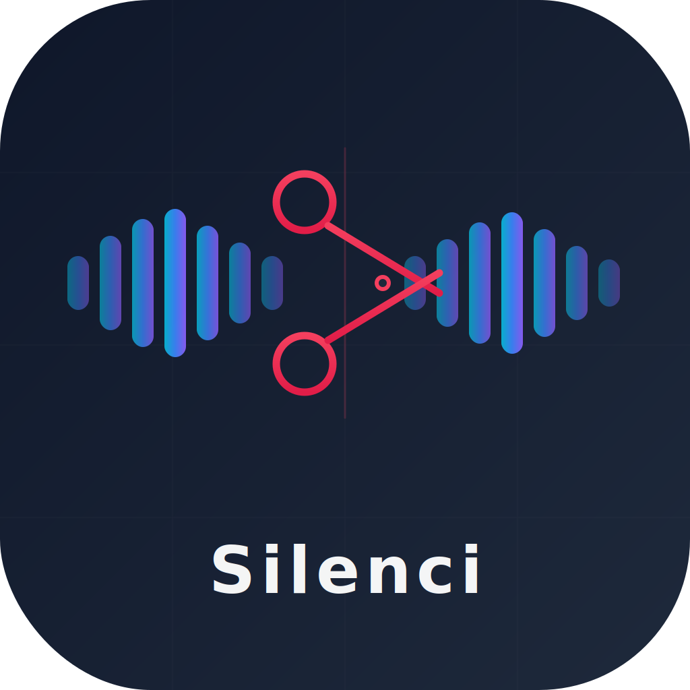
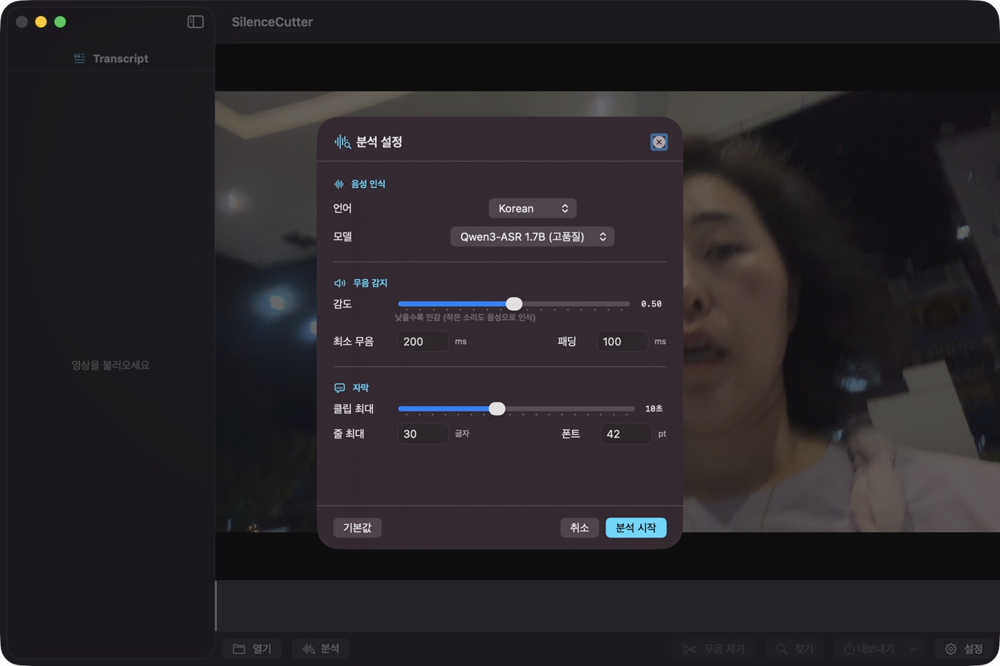
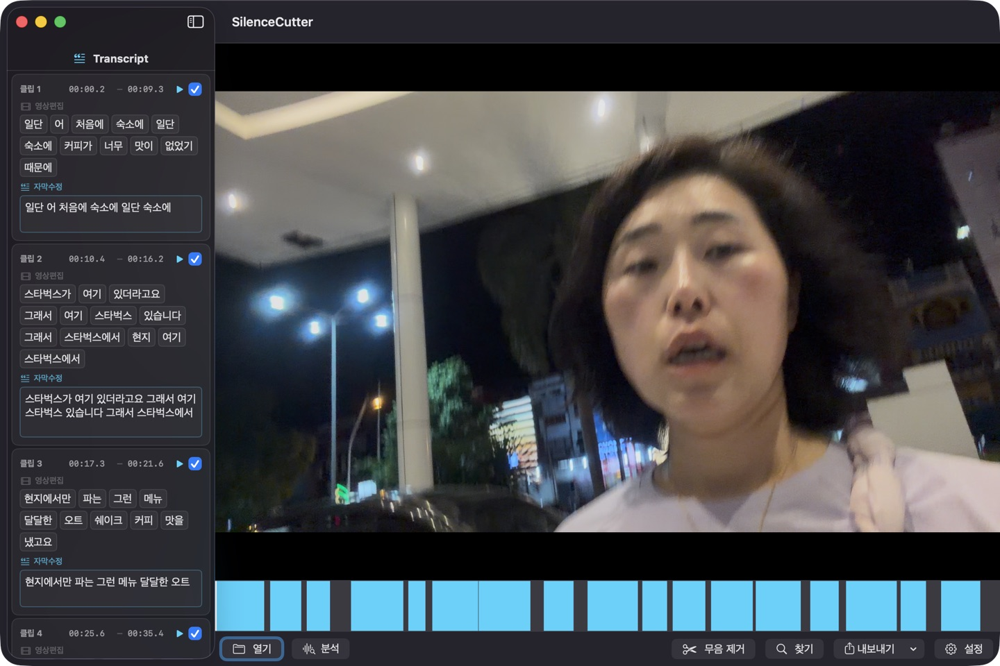

<div align="center">



# 🎬 Silenci

**Automatically remove silence from videos and generate perfectly synced subtitles**

Drop a video → AI detects & cuts silence → Export to Final Cut Pro with word-level subtitles

[](https://www.apple.com/macos/)
[](#)
[](LICENSE)
[](https://github.com/leeyc09/Silenci/stargazers)

[한국어 문서](README.ko.md)

<br/>


</div>

---

## Why Silenci?

Most silence-removal tools split audio **by time**, which cuts words in half.
Silenci uses a **2-Pass ASR** approach — first transcribe, then split only at **word boundaries**.
No mid-word cuts. Ever.

| | Other tools | Silenci |
|:--|:-----------|:---------------|
| Split method | Time-based → words get chopped | Word-boundary → clean cuts |
| Subtitles | Separate tool needed | Built-in, word-level synced |
| Runs on | Cloud / GPU server | 100% local on your Mac |
| Cost | Subscription / API fees | Free & open source |
| Privacy | Upload to cloud | Offline — nothing leaves your Mac |

---

## ✨ Features

<table>
<tr>
<td width="50%">

### 🔇 Smart Silence Removal
- Silero VAD for precise speech detection
- Automatic silence removal → compact timeline
- FCPXML output (import directly to Final Cut Pro)
- Multi-video merge support

</td>
<td width="50%">

### 🗣️ AI Speech Recognition
- **Qwen3-ASR** — high-quality speech-to-text (0.6B / 1.7B)
- **Qwen3-ForcedAligner** — word-level timestamps
- Multi-language: Korean · English · Japanese · Chinese
- MLX 8-bit quantized — Apple Silicon optimized

</td>
</tr>
<tr>
<td>

### ✂️ Word-Level Subtitle Splitting
- Split at sentence endings & punctuation
- Timestamps synced to exact word boundaries
- FCPXML inline titles, SRT, iTT formats
- Customizable font size & max characters per line

</td>
<td>

### 📱 Two Interfaces
- **macOS native app** — drag & drop, real-time preview
- **CLI** — scriptable, automation-friendly

</td>
</tr>
</table>

---

## 🔬 How It Works — 2-Pass ASR Pipeline

<div align="center">

</div>

Most silence-removal tools split audio **by fixed time windows** before running ASR. This causes words to be cut in half at chunk boundaries. Silenci solves this with a **2-pass approach**:

```
Pass 1:  VAD → chunk by silence gaps (≤30s) → ASR + ForcedAligner → word-level timestamps
Pass 2:  Split only at word end_time boundaries → never cuts mid-word
```

#### Detailed Pipeline

| Step | Component | Input | Output |
|:----:|:----------|:------|:-------|
| 1 | **ffprobe** | Video file | fps, resolution, duration |
| 2 | **ffmpeg** | Video file | 16kHz mono WAV |
| 3 | **Silero VAD** | WAV audio | Speech segments `[{start, end}, ...]` |
| 4 | **Split** | Speech segments | ≤30s chunks (split at silence gaps, not mid-speech) |
| 5 | **Qwen3-ASR** | Audio chunk | Transcribed text |
| 6 | **Qwen3-ForcedAligner** | Audio + text | Word-level `[{text, start, end}, ...]` |
| 7 | **Word merge** | All words | Full word list with absolute timestamps |
| 8 | **Segment split** | Word list | Segments split at `end_time` boundaries |
| 9 | **Subtitle split** | Segments | Subtitle chunks by punctuation/endings |

When splitting at step 8, the algorithm prefers the **largest silence gap** between words, producing natural sentence-like segments.

---

## 🏗️ Architecture

<div align="center">

</div>

### Swift ↔ Python Bridge

The app uses a **dual-process architecture**: a Swift frontend communicates with a Python subprocess via **JSON-RPC 2.0** over stdin/stdout pipes.

```
┌──────────────────────┐          stdin (JSON)          ┌──────────────────────┐
│   Swift macOS App    │  ──── {"method":"analyze"} ──→ │  Python Subprocess   │
│                      │                                │                      │
│  • SwiftUI Views     │  ←── {"result": segments} ──── │  • silence_cutter/   │
│  • PythonBridge      │                                │    server.py         │
│  • ExportService     │  ←── {"method":"progress"} ──  │  • Silero VAD        │
│  • PythonEnvironment │        (notifications)         │  • Qwen3-ASR (MLX)   │
└──────────────────────┘          stdout (JSON)         └──────────────────────┘
```

**Why this architecture?**
- **Isolation**: Python ML stack (PyTorch, MLX) runs in a separate process — crashes don't take down the UI
- **Streaming progress**: JSON-RPC notifications push real-time progress (VAD %, ASR chunk N/M, model download bytes)
- **No FFI overhead**: No ctypes/cffi bindings needed — just line-delimited JSON
- **Cancelable**: Swift can kill the Python process at any time for instant cancellation

#### JSON-RPC Protocol

```jsonc
// Request (Swift → Python)
{"id": 1, "method": "analyze", "params": {"video_path": "/path/to/video.mp4", "language": "English"}}

// Progress notification (Python → Swift, no id)
{"method": "progress", "params": {"phase": "analyze", "percent": 45, "detail": "Transcribing (12/26)"}}

// Model download notification
{"method": "progress", "params": {"phase": "model_download", "percent": 67, "detail": "1.2 GB / 1.7 GB"}}

// Response (Python → Swift)
{"id": 1, "result": {"segments": [...], "video_info": {"fps": 23.976, "width": 1920, "height": 1080}}}
```

### Auto-Install System

On first launch, `PythonEnvironment.swift` handles a fully automated setup chain:

```
App launch
  → Check Homebrew     (not found? → install via official script)
  → Check Python3      (not found? → brew install python@3)
  → Check ffmpeg       (not found? → brew install ffmpeg)
  → Create venv        (~/Library/Application Support/Silenci/venv/)
  → pip install        (torch, mlx-audio, silero-vad, soundfile, numpy, soynlp)
  → Write version stamp (.sc-version)
  → Ready ✅
```

Subsequent launches skip installation if the version stamp matches. Bumping `envVersion` in code forces a clean reinstall.

---

## 🖥️ macOS App

Native SwiftUI app — load a video, configure settings, analyze, edit, and export in one window.

<div align="center">

### 📋 Analysis Settings


<br/>

### 📊 Real-time Progress


<br/>

### ✂️ Word-level Editing


</div>

### App Features

| Feature | Description |
|:--------|:------------|
| 🎬 **Load video** | Drag & drop or File → Open |
| ⚙️ **Analysis settings** | Auto-popup on load — language, model, VAD sensitivity |
| 📊 **Real-time progress** | Separate progress for analysis & model download |
| ⛔ **Cancel analysis** | Stop anytime with cancel button |
| ✂️ **Word-level editing** | Delete/restore words, split/merge clips |
| 🔍 **Find & Replace** | Cmd+F to batch-edit subtitle text |
| 📤 **Export** | FCPXML, SRT, iTT — all word-boundary split |

### Analysis Settings

| Category | Setting | Default | Description |
|:--------:|:--------|:-------:|:------------|
| Speech | Language | Korean | Korean / English / Japanese / Chinese |
| | ASR Model | 0.6B | 0.6B (fast) / 1.7B (accurate) |
| Silence | VAD Sensitivity | 0.50 | 0.1–0.9 (lower = more sensitive) |
| | Min Silence | 200ms | Shorter silences are ignored |
| | Padding | 100ms | Buffer around speech segments |
| Subtitle | Max Clip Length | 8s | 3–20s slider |
| | Max Chars/Line | 20 | Subtitle line break threshold |
| | Font Size | 42pt | FCPXML subtitle font |

> Settings are persisted via UserDefaults across app restarts.

### Build & Run

```bash
./build-release.sh                # Build → dist/SilenciApp.app
open dist/SilenciApp.app    # Launch
```

### First Launch — Auto Setup

<div align="center">

</div>

On first launch, the app **automatically creates a Python venv** and installs dependencies (~45 seconds).
ASR models are downloaded on first analysis with byte-level progress tracking.

| Item | Path | Size |
|:----:|------|:----:|
| 🐍 Python venv | `~/Library/Application Support/Silenci/venv/` | ~1.5 GB |
| 🤖 ASR model cache | `~/.cache/huggingface/hub/` | ~1-2 GB |

### Complete Uninstall

**Option 1 — From the app:**
> Menu bar → **Silenci** → **Python 환경 삭제**

**Option 2 — Manual:**
```bash
rm -rf ~/Library/Application\ Support/Silenci/
rm -rf ~/.cache/huggingface/hub/models--mlx-community--Qwen3-*
```

---

## ⌨️ CLI Usage

```bash
python -m silence_cutter <command> [options]
silence-cutter <command> [options]      # after pip install -e .
```

### `cut` — Silence removal + subtitles

```bash
silence-cutter cut input.mp4                        # basic
silence-cutter cut input.mp4 -o output.fcpxml       # custom output
silence-cutter cut input.mp4 -l English --itt       # English + iTT
```

<details>
<summary><b>📋 All options</b></summary>

| Option | Default | Description |
|:-------|:-------:|:------------|
| `-o, --output` | `<input>.fcpxml` | Output path |
| `-l, --language` | `Korean` | Speech language |
| `--asr-model` | `Qwen3-ASR-1.7B-8bit` | ASR model |
| `--aligner-model` | `Qwen3-ForcedAligner-0.6B-8bit` | Alignment model |
| `--vad-threshold` | `0.5` | VAD sensitivity (0–1) |
| `--min-speech-ms` | `250` | Min speech duration (ms) |
| `--min-silence-ms` | `300` | Min silence duration (ms) |
| `--speech-pad-ms` | `100` | Speech padding (ms) |
| `--font-size` | `42` | Subtitle font size |
| `--max-subtitle-chars` | `20` | Max chars per subtitle line |
| `--itt` | `false` | Also generate iTT subtitles |

</details>

### `multi` — Multi-video merge

```bash
silence-cutter multi video1.mp4 video2.mp4 -o merged.fcpxml --itt
```

### `script` — Script extraction

```bash
silence-cutter script input.mp4 -t -o script.txt    # with timecodes
```

### `resub` — Regenerate subtitles

```bash
silence-cutter resub edited.fcpxml -o final.fcpxml --itt
```

### `extract` — Extract FCPXML subtitles

```bash
silence-cutter extract timeline.fcpxml -t -o script.txt
```

---

## 📦 Output Formats

| Format | Extension | Use Case | Subtitle Splitting |
|:------:|:---------:|:---------|:------------------:|
| **FCPXML** | `.fcpxml` | Final Cut Pro (silence cuts + inline subtitles) | ✅ Word-based |
| **SRT** | `.srt` | Universal subtitles (YouTube, VLC, etc.) | ✅ Word-based |
| **iTT** | `.itt` | iTunes Timed Text (FCP compatible) | ✅ Word-based |
| **TXT** | `.txt` | Plain text script (optional timecodes) | — |

> All subtitle formats use **word-level timestamps for precise splitting**.

### Import to Final Cut Pro

> **File** → **Import** → **XML...** → select the `.fcpxml` file
>
> The silence-removed timeline with embedded subtitles loads automatically.

<div align="center">


*FCPXML timeline + iTT subtitles in Final Cut Pro*
</div>

---

## 📥 Installation

### Requirements

| Item | Requirement |
|:----:|:------------|
| **OS** | macOS 14.0+ (Apple Silicon) |
| **Python** | 3.10+ |
| **ffmpeg** | ffmpeg, ffprobe |
| **Disk** | ~2-4 GB for ASR models |

### Quick Install

```bash
./setup_mac.sh
```

### Manual Install

```bash
brew install ffmpeg
python3 -m venv .venv && source .venv/bin/activate
pip install -e .
```

### Dependencies

| Package | Purpose |
|:--------|:--------|
| `mlx-audio` | Qwen3-ASR / ForcedAligner (MLX backend) |
| `silero-vad` | Voice Activity Detection |
| `torch` | Silero VAD runtime |
| `soundfile` | WAV I/O |
| `numpy<2` | Numerical computation |
| `soynlp` | Korean tokenization (ForcedAligner) |

---

## 🔧 Technical Details

### AI Models — Deep Dive

Silenci uses three AI models from the [Qwen3 family](https://huggingface.co/collections/Qwen/qwen3-audio-6839ceac12e7e8088ce0114b), all running **locally** on Apple Silicon via the [MLX](https://github.com/ml-explore/mlx) framework.

#### Qwen3-ASR (Speech-to-Text)

| | 0.6B | 1.7B |
|:--|:-----|:-----|
| **Model** | `mlx-community/Qwen3-ASR-0.6B-8bit` | `mlx-community/Qwen3-ASR-1.7B-8bit` |
| **Parameters** | 600M | 1.7B |
| **Quantization** | 8-bit (MLX) | 8-bit (MLX) |
| **Disk size** | ~600 MB | ~1.7 GB |
| **Use case** | Fast drafts, short videos | Production quality, long-form |
| **Languages** | Korean, English, Japanese, Chinese, and 10+ more |

Qwen3-ASR is an encoder-decoder transformer trained on large-scale multilingual speech data. The MLX 8-bit quantized versions run efficiently on Apple Silicon's Neural Engine and GPU, achieving near-real-time transcription without requiring a cloud API.

**How it's used in Silenci:**
1. Audio is extracted from video via ffmpeg (16kHz mono WAV)
2. VAD segments are chunked into ≤30s pieces
3. Each chunk is fed to `asr.generate(audio, language=...)` → returns transcribed text

#### Qwen3-ForcedAligner (Word Timestamps)

| | |
|:--|:--|
| **Model** | `mlx-community/Qwen3-ForcedAligner-0.6B-8bit` |
| **Parameters** | 600M |
| **Quantization** | 8-bit (MLX) |
| **Disk size** | ~600 MB |
| **Purpose** | Align transcribed text to audio → word-level `{text, start, end}` |

ForcedAligner takes the ASR output text and the original audio, then aligns each word to its exact position in the audio stream. This is what enables **word-boundary splitting** — the core innovation of Silenci.

**How it's used:**
1. ASR produces text for a chunk: `"Through being someone mobile"`
2. ForcedAligner receives audio + text → outputs:
   ```
   [{text: "Through", start: 0.12, end: 0.45},
    {text: "being",   start: 0.47, end: 0.71},
    {text: "someone", start: 0.73, end: 1.15},
    {text: "mobile",  start: 1.18, end: 1.52}]
   ```
3. Segment splitting only happens at word `end` times (never mid-word)

**Coverage validation:** If ForcedAligner output covers <75% of the ASR text, the result is discarded and the segment falls back to chunk-level timing (safety net for edge cases).

#### Silero VAD (Voice Activity Detection)

| | |
|:--|:--|
| **Model** | Silero VAD v5 |
| **Framework** | PyTorch |
| **Size** | ~2 MB |
| **Speed** | Processes 1 hour of audio in ~3 seconds |
| **Purpose** | Detect speech vs. silence boundaries |

Silero VAD is a lightweight neural network that classifies audio frames as speech or non-speech. It outputs speech timestamps used to:
- Remove silence (the primary feature)
- Define ASR chunk boundaries (speech segments → 30s chunks)
- Calculate energy for optimal split points

**Configurable parameters:**
| Parameter | Default | Effect |
|:----------|:-------:|:-------|
| `threshold` | 0.50 | Speech detection sensitivity (0.1=sensitive, 0.9=strict) |
| `min_speech_ms` | 250 | Minimum speech duration to keep |
| `min_silence_ms` | 200 | Minimum silence to detect as gap |
| `speech_pad_ms` | 100 | Padding added around speech segments |

### Subtitle Splitting Algorithm

The subtitle splitting engine runs both in Python (server-side) and Swift (export-side) with identical logic:

```
Priority 1  Split at punctuation or sentence endings (min 6 chars accumulated)
            Korean endings: 요, 다, 까, 죠, 고, 서, 며, 면, 습니다, 합니다 …
            Punctuation: . ! ? 。，

Priority 2  Force-split when exceeding max_subtitle_chars
            - Include next word if ≤3 chars (prevents Korean particle separation)
            - Hard limit at max_chars + 8 (prevents infinite accumulation)

Priority 3  Auto-correct overlapping timestamps after splitting
```

**Korean-specific post-processing:**
`merge_orphan_josa()` handles cases where ForcedAligner separates Korean particles (조사) at segment boundaries:
```
Before:  "맛집" | "을 검색을..."     ← "을" orphaned from its noun
After:   "맛집을" | "검색을..."      ← particle merged back
```

### Frame Rate Handling

FCPXML requires frame-exact timing. Silenci uses Python `Fraction` arithmetic to avoid floating-point drift:

| fps | FCP Code | Frame Duration | Notes |
|:---:|:--------:|:--------------:|:------|
| 23.976 | 2398 | 1001/24000s | Drop-frame NTSC film |
| 24 | 24 | 100/2400s | Cinema |
| 25 | 25 | 100/2500s | PAL |
| 29.97 | 2997 | 1001/30000s | Drop-frame NTSC |
| 30 | 30 | 100/3000s | Non-drop NTSC |
| 59.94 | 5994 | 1001/60000s | High frame rate |
| 60 | 60 | 100/6000s | Gaming/action |
| 120 | 120 | 100/12000s | iPhone slo-mo |

All time calculations use `Fraction(numerator, denominator)` → converted to FCPXML `offset="N/Ds"` format. This ensures sample-accurate alignment even for long timelines (>1 hour).

### Model Download & Caching

ASR models are downloaded from Hugging Face Hub on first analysis:

```
~/.cache/huggingface/hub/
  models--mlx-community--Qwen3-ASR-0.6B-8bit/
  models--mlx-community--Qwen3-ASR-1.7B-8bit/
  models--mlx-community--Qwen3-ForcedAligner-0.6B-8bit/
```

Silenci monkey-patches `huggingface_hub.snapshot_download`'s tqdm progress bars to capture **byte-level download progress** and forward it to the UI via JSON-RPC notifications. This provides accurate "1.2 GB / 1.7 GB" progress display during model downloads.

---

## 🗂️ Project Structure

```
Silenci/
├── silence_cutter/                  # Python package
│   ├── server.py                    # JSON-RPC server (2-pass ASR)
│   ├── vad.py                       # Silero VAD + silence-based splitting
│   ├── transcribe.py                # Qwen3-ASR + ForcedAligner + josa merge
│   ├── fcpxml.py                    # FCPXML generation + subtitle splitting
│   ├── srt.py / itt.py              # SRT, iTT subtitles
│   ├── pipeline.py                  # CLI pipeline
│   └── ...
├── SilenciApp/                # Swift macOS app
│   ├── Package.swift
│   └── Sources/
│       ├── App.swift                # Entry point + menu (env cleanup)
│       ├── ContentView.swift        # Main layout + analysis popup
│       ├── Models/
│       │   ├── AnalysisService.swift    # Analysis runner + Python bridge
│       │   ├── AnalysisSettings.swift   # Settings model (UserDefaults)
│       │   └── ...
│       ├── Services/
│       │   ├── PythonBridge.swift        # JSON-RPC communication
│       │   ├── PythonEnvironment.swift   # Auto venv install/cleanup
│       │   └── ExportService.swift       # FCPXML/SRT/iTT (word-based split)
│       └── Views/
│           ├── AnalyzeDialogView.swift   # Pre-analysis settings popup
│           ├── AnalysisProgressView.swift # Progress + model download + cancel
│           ├── ClipCardView.swift        # Clip card (video edit + subtitle)
│           ├── WordFlowView.swift        # Word-level editing UI
│           └── SettingsView.swift        # Settings sheet
├── build-release.sh                 # Release build → dist/SilenciApp.app
├── setup_mac.sh                     # Auto Python environment setup
└── docs/                            # Diagrams & screenshots
```

---

## 🛠️ Troubleshooting

<details>
<summary><b>ffmpeg/ffprobe not found</b></summary>

```bash
brew install ffmpeg
```

The app automatically adds `/opt/homebrew/bin` to PATH.
</details>

<details>
<summary><b>Model download is slow</b></summary>

ASR models are downloaded from Hugging Face on first analysis.
Byte-level progress is shown in the app. After download, models are cached in `~/.cache/huggingface/hub/`.
</details>

<details>
<summary><b>VAD is too sensitive / not sensitive enough</b></summary>

**App:** Adjust **VAD Sensitivity** slider in the analysis popup.

**CLI:**

| Direction | Parameter |
|:----------|:----------|
| More sensitive (catch quiet speech) | `--vad-threshold 0.3` |
| Less sensitive (only clear speech) | `--vad-threshold 0.7` |
| Remove short silences too | `--min-silence-ms 150` |
| Only remove long silences | `--min-silence-ms 500` |
</details>

<details>
<summary><b>Subtitles are too short / too long</b></summary>

**App:** Adjust **Max Chars** in the analysis popup (default: 20).

**CLI:** `--max-subtitle-chars 30` for longer lines.
</details>

<details>
<summary><b>Words are cut in the middle of subtitles</b></summary>

The 2-Pass ASR approach prevents mid-word cuts.
If it still happens, try increasing `--max-segment-seconds` (default 8s → 15s).
</details>

---

## 🧑‍💻 Contributing

```bash
pip install -e ".[dev]"          # Install dev dependencies
pytest                           # Run tests
black --line-length 100 .        # Format
ruff check silence_cutter/       # Lint
```

Contributions are welcome! Please feel free to submit issues and pull requests.

---

## ⭐ Support

If you find this project useful, please consider giving it a **star** ⭐

It helps others discover the project and motivates continued development.

[](https://star-history.com/#leeyc09/Silence-Cutter&Date)

---

## 📄 License

[Apache License 2.0](LICENSE)
