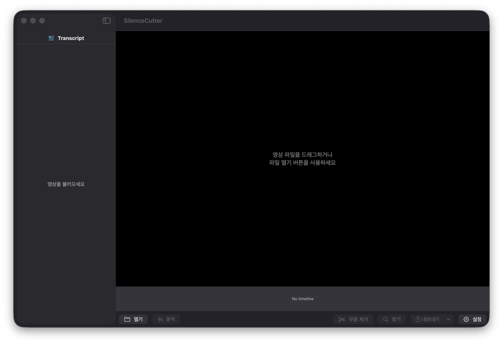

<div align="center">

# 🎬 Silence Cutter

**AI 무음 자동 편집 · 자막 생성 도구**

Silero VAD + Qwen3-ASR 기반 — macOS Apple Silicon 최적화

[](https://www.apple.com/macos/)
[](https://python.org)
[](https://github.com/ml-explore/mlx)
[](LICENSE)

<br/>


<br/>

영상에서 무음 구간을 자동 감지·제거하고, 단어 단위 타임스탬프 자막과 함께
FCPXML을 생성합니다.

[macOS 앱](#-macos-앱) · [CLI 사용법](#-cli-명령어) · [Web UI](#-web-ui) · [설치](#-설치)

</div>

---

## ✨ 주요 기능

<table>
<tr>
<td width="50%">

### 🔇 무음 컷 편집
- Silero VAD로 음성/무음 정밀 감지
- 무음 구간 자동 제거 → 컴팩트 타임라인
- FCPXML 출력 (Final Cut Pro 바로 임포트)
- 멀티 영상 병합 지원

</td>
<td width="50%">

### 🗣️ AI 음성 인식
- **Qwen3-ASR** — 고품질 음성→텍스트 (0.6B / 1.7B)
- **Qwen3-ForcedAligner** — 단어 단위 정밀 타임스탬프
- 다국어: 한국어 · 영어 · 일본어 · 중국어
- MLX 8-bit 양자화 — Apple Silicon 최적화

</td>
</tr>
<tr>
<td>

### ✂️ 스마트 자막 분할
- 한국어 종결어미·구두점 기반 자연스러운 줄 분할
- 단어 타임스탬프 기반 정확한 싱크
- FCPXML 내장 타이틀, SRT, iTT 포맷 지원
- 폰트 크기, 최대 글자 수 커스터마이징

</td>
<td>

### 📱 3가지 인터페이스
- **macOS 네이티브 앱** — 드래그 앤 드롭, 실시간 미리보기
- **CLI** — 스크립트/자동화에 최적
- **Web UI** — Gradio 기반 브라우저 인터페이스

</td>
</tr>
</table>

---

## 🔬 처리 파이프라인

<div align="center">

</div>

### 2-Pass ASR — 단어 잘림 방지

기존 도구들은 오디오를 시간 기반으로 분할 후 ASR을 수행하여 단어 중간에서 잘리는 문제가 있습니다.
Silence Cutter는 **2-Pass 방식**으로 이를 해결합니다:

```
Pass 1:  VAD → 큰 청크(30초)로 ASR + ForcedAligner → 단어별 타임스탬프 확보
Pass 2:  단어의 end_time 경계에서만 분할 → 절대 단어 중간에서 잘리지 않음
```

분할 시 단어 간 **gap(묵음)이 가장 큰 지점**을 우선 선택하여 자연스러운 문장 경계에서 나뉩니다.

---

## 🏗️ 아키텍처

<div align="center">

</div>

Swift macOS 앱이 Python subprocess와 **JSON-RPC 2.0** 프로토콜로 통신합니다.
stdin/stdout 파이프를 통해 요청·응답을 주고받으며, 진행률 알림도 실시간으로 전달됩니다.

---

## 🖥️ macOS 앱

네이티브 SwiftUI 앱으로, 영상을 불러오면 분석 설정 팝업이 자동으로 열리고 — 설정 후 분석·편집·내보내기까지 한 화면에서 처리합니다.

<div align="center">

</div>

### 앱 기능

| 기능 | 설명 |
|:-----|:-----|
| 🎬 **영상 불러오기** | 드래그 앤 드롭 또는 파일 열기 |
| ⚙️ **분석 설정 팝업** | 영상 로드 시 자동 표시 — 언어, 모델, VAD 감도 등 설정 |
| 📊 **실시간 진행률** | 분석/모델 다운로드 진행률 별도 표시 |
| ⛔ **분석 취소** | 진행 중 취소 버튼으로 즉시 중단 |
| ✂️ **단어 단위 편집** | 단어별 삭제/복구, 클립 분할/병합 |
| 🔍 **찾기/바꾸기** | Cmd+F로 자막 텍스트 일괄 수정 |
| 📤 **내보내기** | FCPXML, SRT, iTT — 모두 단어 기반 분할 |

### 분석 설정 옵션

| 카테고리 | 설정 | 기본값 | 설명 |
|:-------:|:-----|:-----:|:-----|
| 음성 인식 | 언어 | Korean | Korean / English / Japanese / Chinese |
| | ASR 모델 | 0.6B | 0.6B (빠름) / 1.7B (고품질) |
| 무음 감지 | VAD 감도 | 0.50 | 0.1~0.9 (낮을수록 민감) |
| | 최소 무음 | 200ms | 이보다 짧은 무음은 무시 |
| | 패딩 | 100ms | 음성 구간 앞뒤 여유 |
| 자막 | 클립 최대 길이 | 8초 | 3~20초 슬라이더 |
| | 줄 최대 글자 | 20 | 자막 줄바꿈 기준 |
| | 폰트 크기 | 42pt | FCPXML 자막 폰트 |

> 설정은 UserDefaults에 저장되어 앱 재시작 후에도 유지됩니다.

### 빌드 & 실행

```bash
./build-release.sh                # 빌드 → dist/SilenceCutterApp.app
open dist/SilenceCutterApp.app    # 실행
```

### 첫 실행 자동 설치

<div align="center">

</div>

처음 실행하면 Python 환경을 **자동으로 설치**합니다 (약 45초 소요).
ASR 모델은 첫 분석 시 자동 다운로드되며, 진행률이 실시간으로 표시됩니다.

### 데이터 저장 경로

| 항목 | 경로 | 크기 |
|:---:|------|:---:|
| 🐍 Python venv | `~/Library/Application Support/SilenceCutter/venv/` | ~1.5 GB |
| 🤖 ASR 모델 캐시 | `~/.cache/huggingface/hub/` | ~1-2 GB |

### 앱 삭제 (완전 제거)

macOS는 `.app`을 휴지통에 버려도 Application Support 데이터는 자동 삭제되지 않습니다.

**방법 1 — 앱 내에서 삭제:**

> 메뉴바 → **SilenceCutter** → **Python 환경 삭제** 클릭

**방법 2 — 수동 삭제:**

```bash
# Python 가상환경 삭제
rm -rf ~/Library/Application\ Support/SilenceCutter/

# (선택) ASR 모델 캐시 삭제 — 다른 앱과 공유될 수 있음
rm -rf ~/.cache/huggingface/hub/models--mlx-community--Qwen3-*
```

---

## 🌐 Web UI

Gradio 기반 브라우저 인터페이스. 5개 탭으로 모든 기능을 지원합니다.

<div align="center">

</div>

```bash
./run.sh                          # 기본 실행 (포트 7860)
./run.sh --port 8080 --share      # 포트 지정 + 공유 링크
```

| 탭 | 설명 |
|:---|:-----|
| **무음 컷** | 영상 → 무음 제거 + 자막 FCPXML |
| **VAD 자막 생성** | 원본 타임라인 기준 SRT/iTT |
| **자막 재생성** | 편집된 FCPXML 자막 재생성 |
| **VAD 대본 추출** | 대본 텍스트 추출 |
| **FCPXML 자막 추출** | FCPXML 내 타이틀 텍스트 추출 |

---

## ⌨️ CLI 명령어

```bash
python -m silence_cutter <command> [options]
silence-cutter <command> [options]      # pip install -e . 이후
```

### `cut` — 무음 컷 + 자막

```bash
silence-cutter cut input.mp4                        # 기본
silence-cutter cut input.mp4 -o output.fcpxml       # 출력 경로
silence-cutter cut input.mp4 -l English --itt       # 영어 + iTT
```

<details>
<summary><b>📋 전체 옵션</b></summary>

| 옵션 | 기본값 | 설명 |
|:-----|:------:|:-----|
| `-o, --output` | `<입력>.fcpxml` | 출력 경로 |
| `-l, --language` | `Korean` | 음성 언어 |
| `--asr-model` | `Qwen3-ASR-1.7B-8bit` | ASR 모델 |
| `--aligner-model` | `Qwen3-ForcedAligner-0.6B-8bit` | 정렬 모델 |
| `--vad-threshold` | `0.5` | VAD 민감도 (0~1) |
| `--min-speech-ms` | `250` | 최소 음성 구간 (ms) |
| `--min-silence-ms` | `300` | 최소 무음 구간 (ms) |
| `--speech-pad-ms` | `100` | 음성 앞뒤 패딩 (ms) |
| `--font-size` | `42` | 자막 폰트 크기 |
| `--max-subtitle-chars` | `20` | 한 줄 최대 글자 수 |
| `--itt` | `false` | iTT 자막 동시 생성 |

</details>

### `multi` — 멀티 영상 병합

```bash
silence-cutter multi video1.mp4 video2.mp4 -o merged.fcpxml --itt
```

### `script` — 대본 추출

```bash
silence-cutter script input.mp4 -t -o script.txt    # 타임코드 포함
```

### `resub` — 자막 재생성

```bash
silence-cutter resub edited.fcpxml -o final.fcpxml --itt
```

### `extract` — FCPXML 자막 추출

```bash
silence-cutter extract timeline.fcpxml -t -o script.txt
```

---

## 📦 출력 포맷

| 포맷 | 확장자 | 용도 | 자막 분할 |
|:----:|:------:|:-----|:--------:|
| **FCPXML** | `.fcpxml` | Final Cut Pro (무음 컷 + 자막 내장) | ✅ 단어 기반 |
| **SRT** | `.srt` | 범용 자막 (YouTube, VLC 등) | ✅ 단어 기반 |
| **iTT** | `.itt` | iTunes Timed Text (FCP 호환 자막) | ✅ 단어 기반 |
| **TXT** | `.txt` | 대본 텍스트 (선택적 타임코드) | — |

> 모든 자막 포맷이 **단어 타임스탬프 기반으로 정확하게 분할**됩니다.
> `maxSubtitleChars` 설정으로 줄 길이를 조절할 수 있습니다.

### Final Cut Pro에서 열기

> **File** → **Import** → **XML...** → `.fcpxml` 선택
>
> 무음이 제거된 타임라인과 자막이 자동으로 로드됩니다.

---

## 📥 설치

### 시스템 요구 사항

| 항목 | 요구 사항 |
|:----:|:----------|
| **OS** | macOS 14.0+ (Apple Silicon 권장) |
| **Python** | 3.10 이상 |
| **ffmpeg** | ffmpeg, ffprobe |
| **디스크** | ASR 모델 약 2~4GB |

### 자동 설치 (권장)

```bash
./setup_mac.sh
```

### 수동 설치

```bash
brew install ffmpeg
python3 -m venv .venv && source .venv/bin/activate
pip install -e .
```

### 의존성

| 패키지 | 용도 |
|:-------|:-----|
| `mlx-audio` | Qwen3-ASR / ForcedAligner (MLX) |
| `silero-vad` | 음성 활동 감지 |
| `torch` | Silero VAD 런타임 |
| `soundfile` | WAV I/O |
| `numpy<2` | 수치 연산 |
| `soynlp` | 한국어 토크나이제이션 (ForcedAligner) |
| `gradio` | Web UI |

---

## 🔧 기술 세부 사항

### ASR 모델

| 모델 | 크기 | 특징 |
|:-----|:----:|:-----|
| `mlx-community/Qwen3-ASR-0.6B-8bit` | ~600MB | 가벼운 추론 |
| `mlx-community/Qwen3-ASR-1.7B-8bit` | ~1.7GB | 높은 정확도 |
| `mlx-community/Qwen3-ForcedAligner-0.6B-8bit` | ~600MB | 단어 타임스탬프 |

> 모든 모델은 MLX 8-bit 양자화. Apple Silicon Neural Engine에서 효율적으로 동작합니다.
> 첫 실행 시 Hugging Face에서 자동 다운로드 → `~/.cache/huggingface/hub/`에 캐시.
> 앱에서 다운로드 진행률이 **바이트 단위**로 실시간 표시됩니다.

### 자막 분할 알고리즘

```
1순위  구두점 또는 한국어 종결어미에서 분할 (최소 6글자 이상)
       종결어미: 요, 다, 까, 죠, 고, 서, 며, 면, 습니다, 합니다 …
       구두점: . ! ? 。，

2순위  max_subtitle_chars 초과 시 강제 분할
       - 다음 단어가 3자 이하면 포함 (조사 분리 방지)
       - max_chars + 8 상한 초과 시 무조건 분할

3순위  분할 후 겹치는 타임스탬프 자동 보정
```

### 세그먼트 경계 후처리

ForcedAligner가 형태소 단위로 단어를 분리하기 때문에, 세그먼트 경계에서 조사가 분리될 수 있습니다.
`merge_orphan_josa`가 이를 자동 보정합니다:

```
Before:  "맛집" | "을 검색을..."
After:   "맛집 을" | "검색을..."
```

### 프레임레이트

`Fraction` 기반 정밀 계산으로 부동소수점 오차를 방지합니다.

| fps | FCP 코드 | 프레임 듀레이션 |
|:---:|:--------:|:--------------:|
| 23.976 | 2398 | 1001/24000s |
| 24 | 24 | 100/2400s |
| 25 | 25 | 100/2500s |
| 29.97 | 2997 | 1001/30000s |
| 30 | 30 | 100/3000s |
| 59.94 | 5994 | 1001/60000s |
| 60 | 60 | 100/6000s |
| 120 | 120 | 100/12000s |

---

## 🗂️ 프로젝트 구조

```
Qwen3-TTS-Mac/
├── silence_cutter/                  # Python 패키지
│   ├── server.py                    # JSON-RPC 서버 (2-pass ASR)
│   ├── vad.py                       # Silero VAD + 묵음 기반 분할
│   ├── transcribe.py                # Qwen3-ASR + ForcedAligner + 조사 병합
│   ├── fcpxml.py                    # FCPXML 생성 + 자막 분할
│   ├── srt.py / itt.py              # SRT, iTT 자막
│   ├── pipeline.py                  # CLI 파이프라인
│   ├── app.py                       # Gradio Web UI
│   └── ...
├── SilenceCutterApp/                # Swift macOS 앱
│   ├── Package.swift
│   └── Sources/
│       ├── App.swift                # 앱 진입점 + 메뉴 (환경 삭제)
│       ├── ContentView.swift        # 메인 레이아웃 + 분석 팝업 연결
│       ├── Models/
│       │   ├── AnalysisService.swift    # 분석 실행/취소 + Python bridge 관리
│       │   ├── AnalysisSettings.swift   # 설정 모델 (UserDefaults 저장)
│       │   ├── Segment.swift / Word.swift
│       │   └── ...
│       ├── Services/
│       │   ├── PythonBridge.swift        # JSON-RPC 통신 + PATH 설정
│       │   ├── PythonEnvironment.swift   # venv 자동 설치/삭제/버전 관리
│       │   └── ExportService.swift       # FCPXML/SRT/iTT 생성 (단어 기반 분할)
│       └── Views/
│           ├── AnalyzeDialogView.swift   # 분석 전 설정 팝업
│           ├── AnalysisProgressView.swift # 진행률 + 모델 다운로드 + 취소
│           ├── ClipCardView.swift        # 클립 카드 (영상편집 + 자막수정)
│           ├── WordFlowView.swift        # 단어 단위 편집 UI
│           ├── SettingsView.swift        # 설정 시트
│           └── ...
├── build-release.sh                 # 릴리스 빌드 → dist/SilenceCutterApp.app
├── setup_mac.sh                     # Python 환경 자동 설치
├── run.sh                           # Web UI 실행
└── docs/                            # 다이어그램, 스크린샷
```

---

## 🛠️ 문제 해결

<details>
<summary><b>ffmpeg/ffprobe를 찾을 수 없습니다</b></summary>

```bash
brew install ffmpeg
```

앱에서는 `/opt/homebrew/bin`을 자동으로 PATH에 추가합니다.
</details>

<details>
<summary><b>모델 다운로드가 느립니다</b></summary>

첫 분석 시 Hugging Face Hub에서 ASR 모델을 자동 다운로드합니다.
바이트 단위 진행률이 앱에 표시되며, 다운로드 후 `~/.cache/huggingface/hub/`에 캐시되어 이후 바로 로드됩니다.
</details>

<details>
<summary><b>VAD가 너무 민감하거나 둔합니다</b></summary>

앱: 분석 팝업에서 **VAD 감도** 슬라이더 조절

CLI:

| 조절 방향 | 파라미터 |
|:---------|:---------|
| 민감하게 (작은 소리도 인식) | `--vad-threshold 0.3` |
| 둔하게 (확실한 음성만) | `--vad-threshold 0.7` |
| 짧은 무음도 제거 | `--min-silence-ms 150` |
| 긴 무음만 제거 | `--min-silence-ms 500` |
</details>

<details>
<summary><b>자막이 너무 잘게/크게 나뉩니다</b></summary>

앱: 분석 팝업에서 **줄 최대** 글자 수 조절 (기본 20)

CLI: `--max-subtitle-chars 30` 으로 줄 길이 증가
</details>

<details>
<summary><b>단어 중간에서 자막이 잘립니다</b></summary>

2-Pass ASR 방식으로 단어 중간 잘림이 발생하지 않습니다.
만약 발생한다면 `--max-segment-seconds` 값을 늘려보세요 (기본 8초 → 15초).
</details>

---

## 🧑‍💻 개발

```bash
pip install -e ".[dev]"          # 개발 의존성 설치
pytest                           # 테스트
black --line-length 100 .        # 포맷팅
ruff check silence_cutter/       # 린트
```

---

## 📄 License

[Apache License 2.0](LICENSE)
